# 🤖 AI RevOps Copilot

> **Conversational Revenue Operations Analytics | Pipeline Intelligence | Real-time Insights**

[](LIVE_LINK_HERE)
[](https://github.com/VinitBhalerao3012/ai-revops-copilot)
[](https://python.org)
[](https://streamlit.io)
[](https://langchain.com)
[](https://groq.com)

---

## 📌 Overview

**AI RevOps Copilot** is a fully deployed, production-standard conversational analytics platform that simulates a real-world Revenue Operations environment. Built to demonstrate advanced data analytics, AI integration, and business intelligence capabilities across a SaaS company's go-to-market tech stack.

The platform combines **LangChain**, **Groq/Llama 3.3 70B**, **SQLite**, **Plotly**, and **Streamlit** to deliver:

- 🗣️ **Conversational AI queries** — ask questions in plain English, get SQL, data tables, AI insights and auto-generated charts
- 📊 **Pipeline dashboards** — Salesforce-style revenue pipeline analytics with KPIs, funnel analysis and sales rep performance
- 🔍 **Automated pipeline hygiene** — proactive data quality checks detecting stale deals, missing fields and overdue close dates
- 👥 **Account health monitoring** — Planhat-style churn risk analysis with health scoring and AI action plans
- 📈 **Revenue analytics** — MRR trends, waterfall analysis, ARR by industry and AI-powered forecasting insights

---

## 🚀 Live Demo

🔗 **[Launch AI RevOps Copilot → LIVE_LINK_HERE](LIVE_LINK_HERE)**

---

## 🖥️ Screenshots

### 💬 Page 1 — AI Copilot Chat (Main Interface)

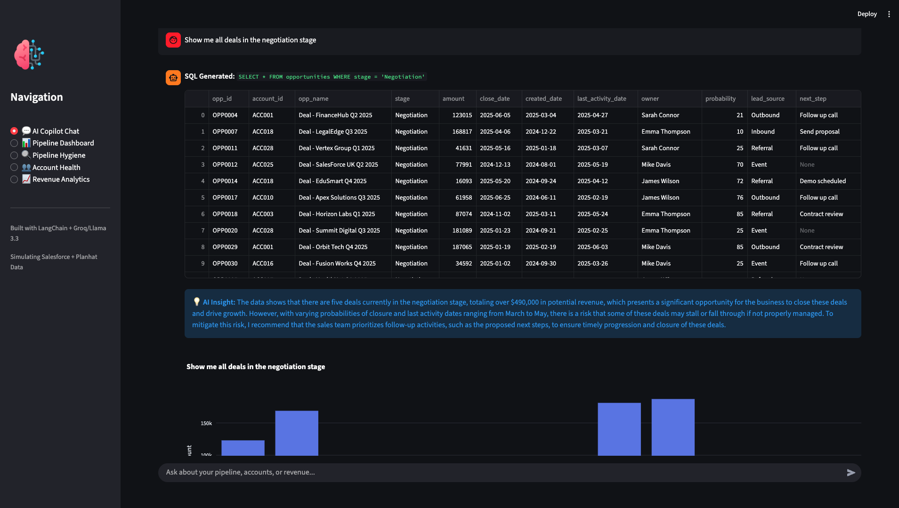
*The main conversational interface — ask anything about your pipeline, accounts, revenue or activities in plain English.*

---

### 💬 AI Copilot Chat — Conversational Query in Action

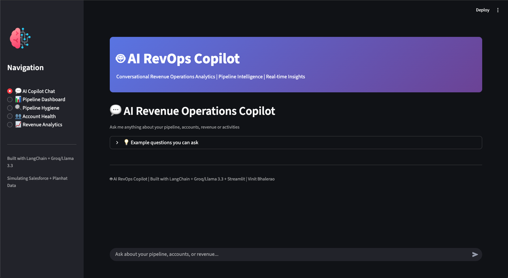
*User asks "Show me all deals in the negotiation stage" — the AI automatically generates SQL, returns a data table, provides an AI insight, and renders an interactive bar chart.*

---

### 💬 AI Copilot Chat — Auto-Generated Chart

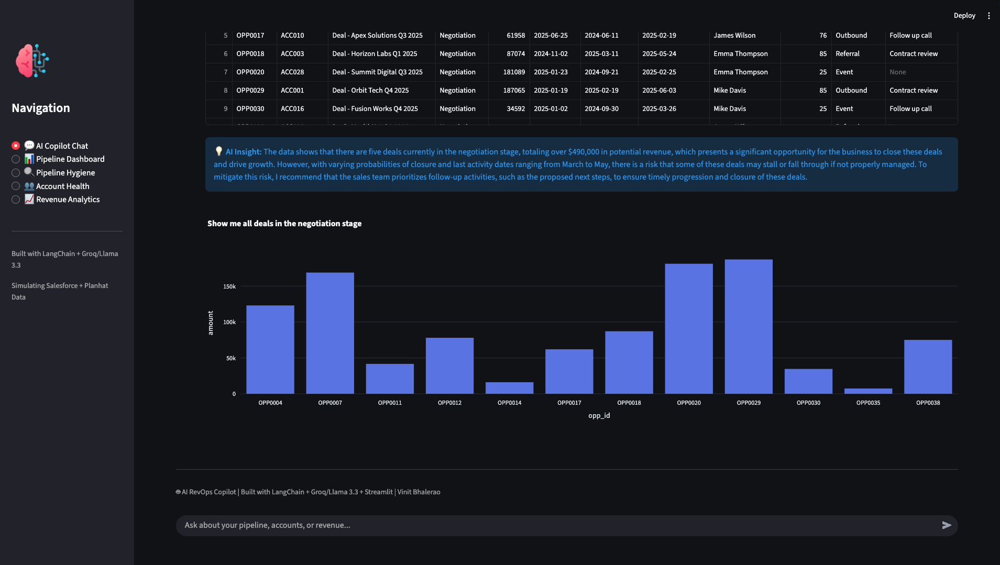
*After every query, the Copilot automatically visualises the results as an interactive Plotly chart — no manual chart building required.*

---

### 📊 Page 2 — Pipeline Dashboard

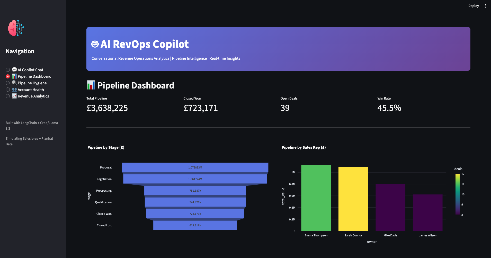
*Real-time pipeline KPIs: £3.6M total pipeline, £723K closed won, 39 open deals, 45.5% win rate. Includes pipeline funnel by stage and performance by sales rep.*

---

### 📊 Pipeline Dashboard — Lead Source & Upcoming Closes

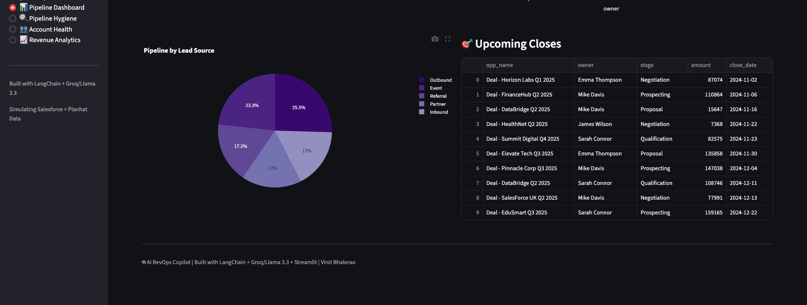
*Pipeline breakdown by lead source (Outbound leads largest at 25.5%) and upcoming deals sorted by close date for the sales team.*

---

### 🔍 Page 3 — Pipeline Hygiene Checker (Overview)

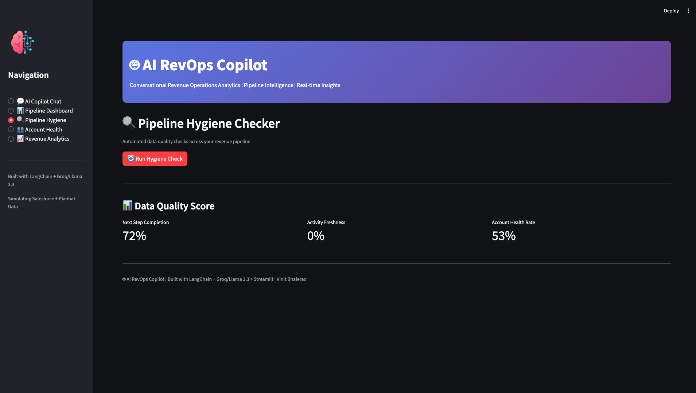
*Automated pipeline hygiene dashboard showing real-time data quality scores: Next Step Completion 72%, Activity Freshness 0%, Account Health Rate 53%.*

---

### 🔍 Pipeline Hygiene — Stale Deals Detected

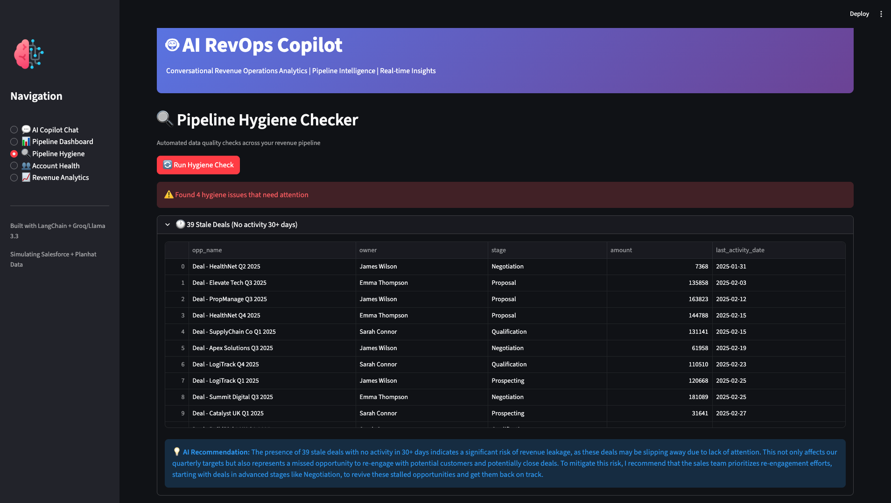
*The hygiene checker automatically identifies 39 stale deals with no activity in 30+ days, with AI-generated recommendations on how to re-engage and protect quarterly targets.*

---

### 🔍 Pipeline Hygiene — Missing Next Steps & At-Risk Accounts

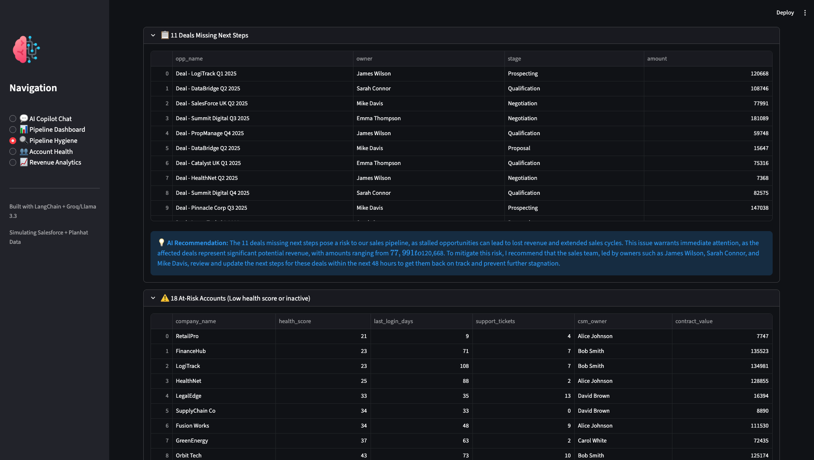
*Flags 11 deals missing next steps and 18 at-risk accounts with low health scores — each with specific AI recommendations naming the account owners and suggested actions.*

---

### 🔍 Pipeline Hygiene — Overdue Close Dates

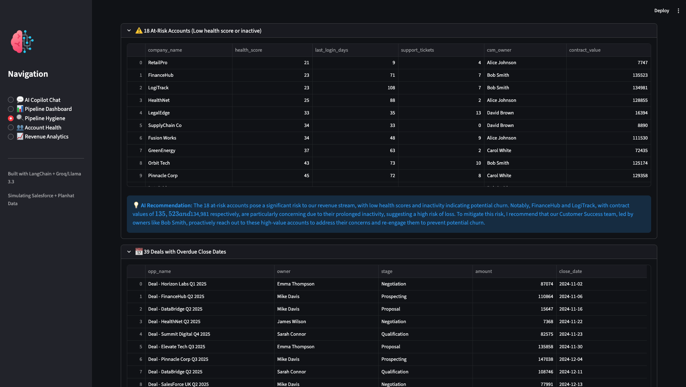
*Identifies 39 deals with overdue close dates and provides AI recommendations to prioritise reviewing and updating forecasts to protect revenue recognition.*

---

### 🔍 Pipeline Hygiene — Complete Hygiene Report

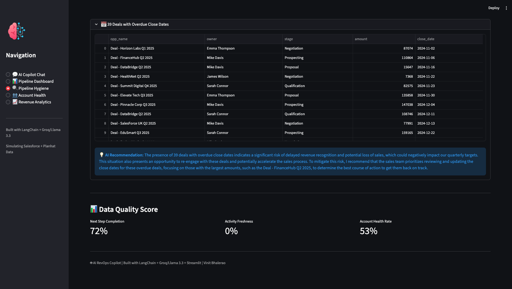
*Full hygiene report showing all 4 issue categories detected, with AI recommendations for each and the overall data quality score summary.*

---

### 👥 Page 4 — Account Health Monitor

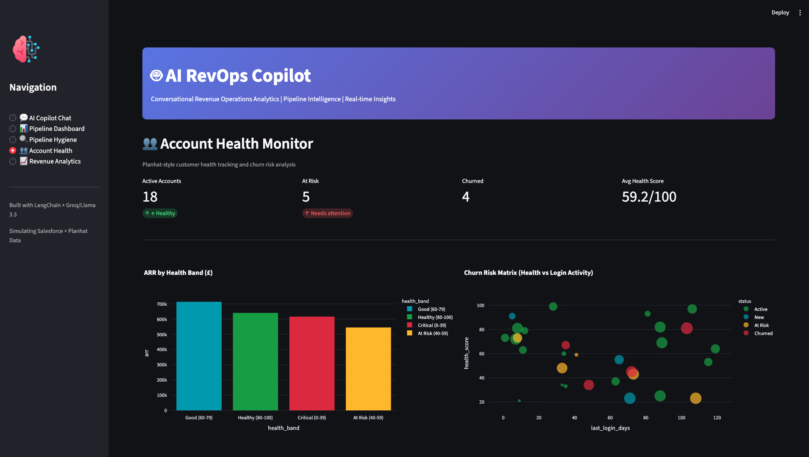
*Planhat-style account health dashboard: 18 active accounts, 5 at risk, 4 churned, average health score 59.2/100. Includes ARR by health band and churn risk scatter matrix.*

---

### 👥 Account Health — Accounts Requiring Immediate Attention

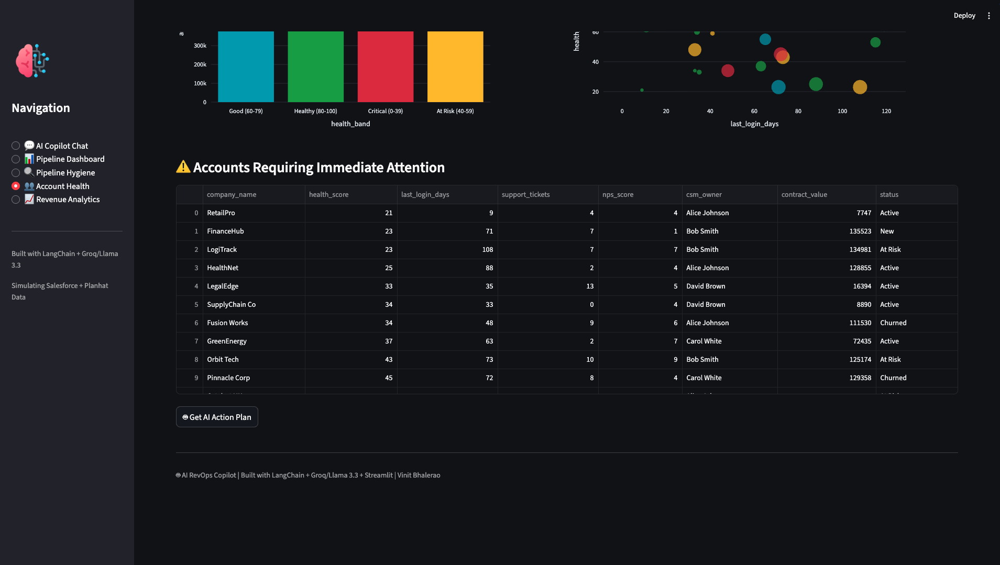
*Detailed table of accounts requiring immediate attention, ranked by health score with support tickets, NPS, CSM owner and contract value — ready for CS team action.*

---

### 👥 Account Health — AI Action Plan

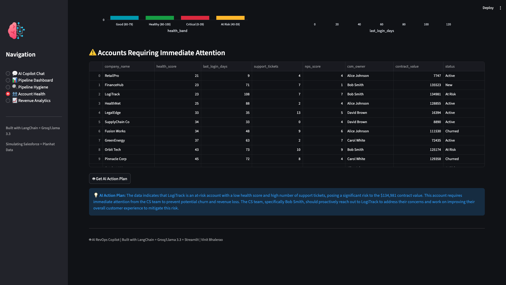
*One-click AI action plan generation — the Copilot analyses the at-risk account data and produces specific, business-focused recommendations naming accounts, owners and contract values at risk.*

---

### 📈 Page 5 — Revenue Analytics

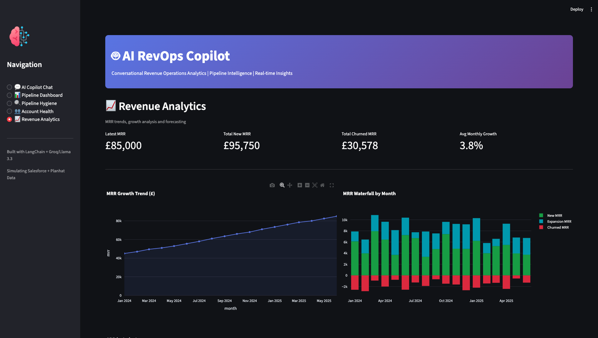
*MRR dashboard: £85,000 latest MRR, £95,750 total new MRR, 3.8% average monthly growth. Includes MRR growth trend line and monthly waterfall chart (new, expansion, churned MRR).*

---

### 📈 Revenue Analytics — ARR by Industry Treemap

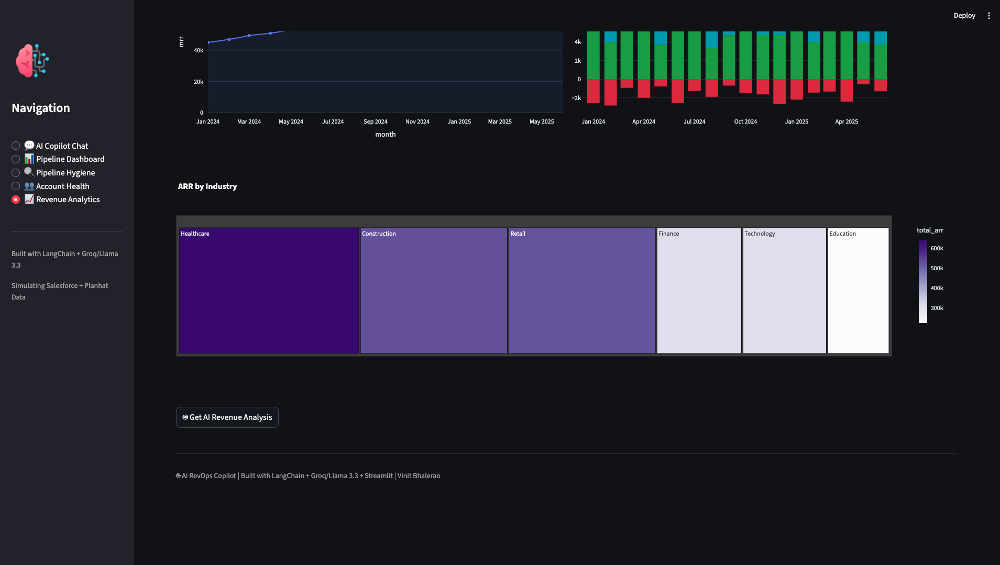
*Interactive treemap visualising ARR distribution across industries: Healthcare leads, followed by Construction and Retail — supporting strategic investment decisions.*

---

### 📈 Revenue Analytics — AI Revenue Insight

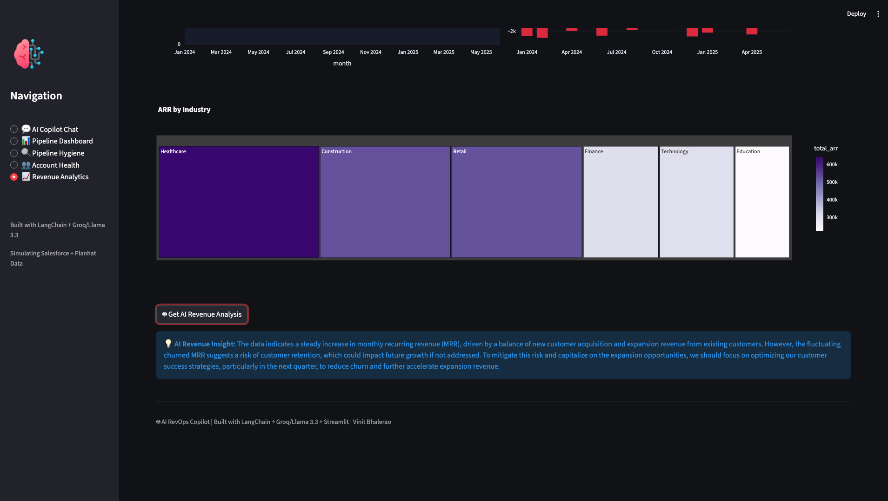
*AI-generated revenue analysis identifying steady MRR growth driven by new customer acquisition and expansion revenue, with specific recommendations to reduce churn in the next quarter.*

---

## 🛠️ Tech Stack

| Technology | Purpose |
|---|---|
| **Python 3.9+** | Core language |
| **Streamlit** | Web application framework |
| **LangChain** | AI agent orchestration and conversational memory |
| **Groq / Llama 3.3 70B** | Large language model backend for SQL generation and insights |
| **SQLite** | Relational database storing pipeline, account, activity and revenue data |
| **Plotly** | Interactive data visualisations and charts |
| **Pandas** | Data manipulation and processing |
| **Great Expectations** | Data quality validation and anomaly detection |
| **DuckDB** | In-memory analytical query engine |
| **Python-dotenv** | Environment variable management |

---

## 📁 Project Structure

```
ai-revops-copilot/
│
├── app.py                  # Main Streamlit application (5 pages)
├── data_generator.py       # Synthetic RevOps dataset generator
├── requirements.txt        # Python dependencies
├── .env                    # API keys (not committed)
├── .gitignore              # Git ignore file
├── .streamlit/
│   └── config.toml         # Streamlit theme configuration
└── screenshots/            # Application screenshots
    ├── Rvo1.png - Rvo16.png
```

---

## 📊 Data Architecture

The app uses a **SQLite database** with 4 tables simulating a real RevOps tech stack:

| Table | Records | Simulates |
|---|---|---|
| `accounts` | 30 | Planhat customer health data |
| `opportunities` | 50 | Salesforce pipeline data |
| `activities` | 100 | CRM activity logs |
| `revenue` | 18 months | MRR/ARR financial data |

---

## ⚡ Key Features

### 🗣️ Conversational AI Copilot
- Ask questions in plain English
- LangChain automatically generates and executes SQL
- Returns data tables, AI insights, and interactive charts
- 10 example queries provided for quick start

### 🔍 Automated Pipeline Hygiene (4 checks)
1. **Stale deals** — no activity in 30+ days
2. **Missing next steps** — open deals with no follow-up action
3. **At-risk accounts** — low health score or inactive customers
4. **Overdue close dates** — deals past their expected close

### 👥 Account Health Scoring
- Health score 0-100 for every account
- Churn risk matrix (health vs login activity)
- ARR at risk by health band
- AI-generated action plans for CS team

### 📈 Revenue Intelligence
- MRR growth trend (18 months)
- Monthly waterfall (new, expansion, churned MRR)
- ARR treemap by industry
- AI revenue analysis and recommendations

---

## 🔧 Local Setup

```bash
# 1. Clone the repository
git clone https://github.com/VinitBhalerao3012/ai-revops-copilot.git
cd ai-revops-copilot

# 2. Install dependencies
pip install -r requirements.txt

# 3. Add your Groq API key
echo "GROQ_API_KEY=your_groq_api_key_here" > .env

# 4. Generate the database
python data_generator.py

# 5. Run the app
streamlit run app.py
```

Get your free Groq API key at: [console.groq.com](https://console.groq.com)

---

## 💼 Business Value & Use Cases

This project demonstrates the core responsibilities of a **Revenue Operations Analyst** role:

| RevOps Responsibility | This Project |
|---|---|
| Pipeline data quality | Automated hygiene checker with 4 checks |
| CRM reporting | Conversational AI query + SQL generation |
| Churn/retention tracking | Account health monitor + risk scoring |
| Forecast reporting | MRR trend + waterfall analysis |
| Stakeholder reporting | Interactive dashboards + AI narratives |
| Ad hoc analysis | Natural language queries → instant results |
| First-line support | Copilot answers sales/CS team questions |

---

## 👤 Author

**Vinit Bhalerao**
- 🌐 Portfolio: [vinitbportfolio.netlify.app](https://vinitbportfolio.netlify.app)
- 💼 LinkedIn: [linkedin.com/in/bhalerao-vinit3013](https://linkedin.com/in/bhalerao-vinit3013)
- 🐙 GitHub: [github.com/VinitBhalerao3012](https://github.com/VinitBhalerao3012)

---

*Built with ❤️ using LangChain + Groq/Llama 3.3 + Streamlit | AI RevOps Copilot | Vinit Bhalerao*